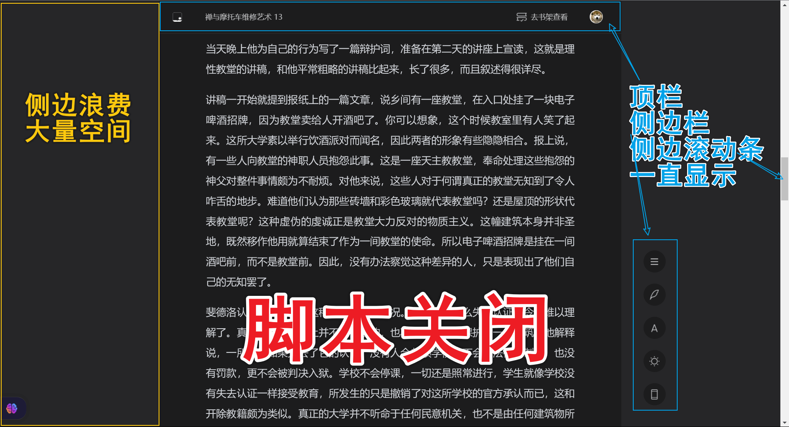
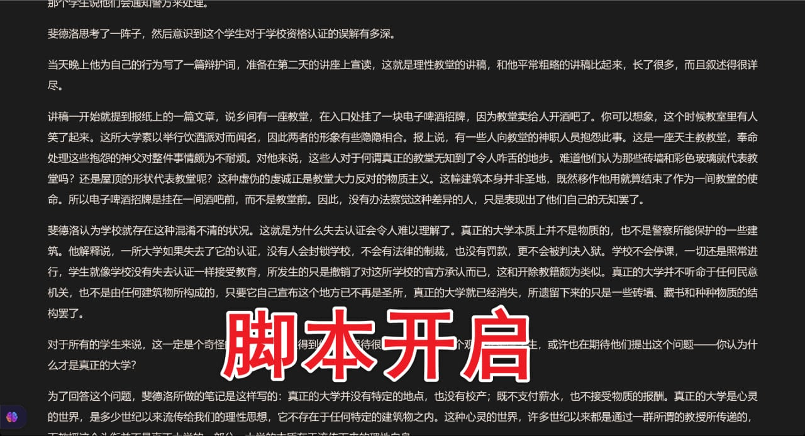

# BetterWeRead
Provide a better reading experience for the WeChat Reading web platform./为微信读书网页端提供更好的阅读体验
## Features
- 去除两侧空白，充分利用您的显示器面积
- 顶栏，侧边栏和滚动条隐藏，获得更沉浸的阅读体验
- 淡金色字体配上深色背景，对视力更好
- 使用 Microsoft YaHei UI 字体。(对比了多个字体，在 Windows 平台糟糕的高分屏适配下，微软雅黑 UI 字体居然是看起来最清晰、最不费眼的。)

## What it looks like/效果展示

